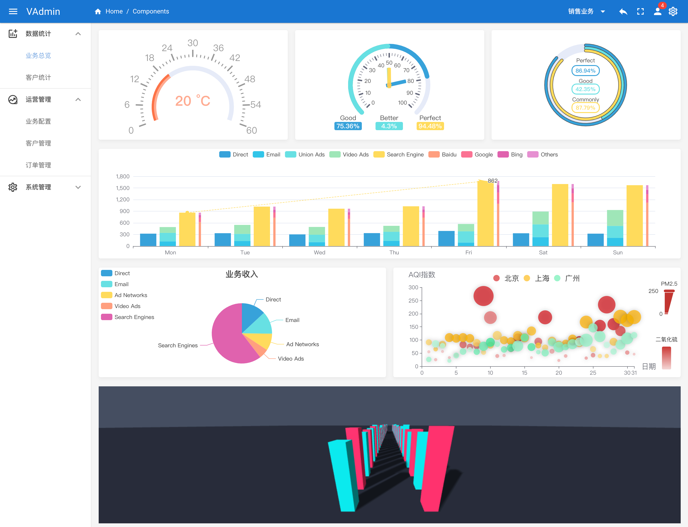

# VQAdmin

This is an Administrator Panel

Thisi admin ui is based on vue3 and quasar2



## Install the dependencies
```bash
yarn
# or
npm install
```

### Start the app in development mode (hot-code reloading, error reporting, etc.)
```bash
quasar dev
```
